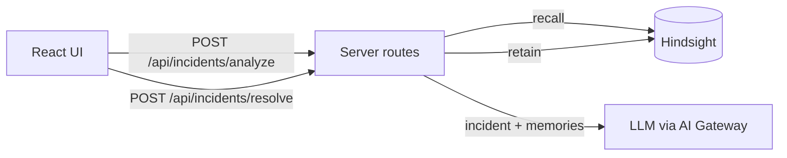

# IncidentMind – AI Incident Response Agent

An AI incident response agent for DevOps teams. It remembers past incidents with **Hindsight** (by Vectorize): it looks up similar past incidents (recall), analyses the new one with an LLM, and stores confirmed resolutions (retain).

## Endpoints
`GET /api/health`, `GET|POST /api/incidents`, `POST /api/incidents/analyze`, `POST /api/incidents/resolve`, `GET /api/memory`, `GET /api/memory/{id}`, `POST /api/memory/seed`, `GET /api/stats`

## Hindsight
- Recall: `POST {HINDSIGHT_BASE_URL}/v1/{ns}/banks/{bank}/memories/recall`
- Retain: `POST .../memories`
- List: `GET .../memories/list`

These are set in `src/lib/hindsight.server.ts`. If Hindsight can't be reached, the app says so. It never pretends a lookup worked.

## Setup
Copy `.env.example` and set `HINDSIGHT_BASE_URL` and `HINDSIGHT_API_KEY`. Then run `bun install && bun run dev`.

## Demo
1. Open Memory and click **Seed historical incidents**.
2. On the Dashboard, click **Demo Mode**, then **Analyze Incident**.
3. Resolve the incident and click **Save to Hindsight Memory**.
4. Submit a similar incident. The new memory is recalled.

## Future improvements
- Store incidents in a database so the list survives restarts.
- Add team sign-in.
- Add Slack and PagerDuty integrations.
